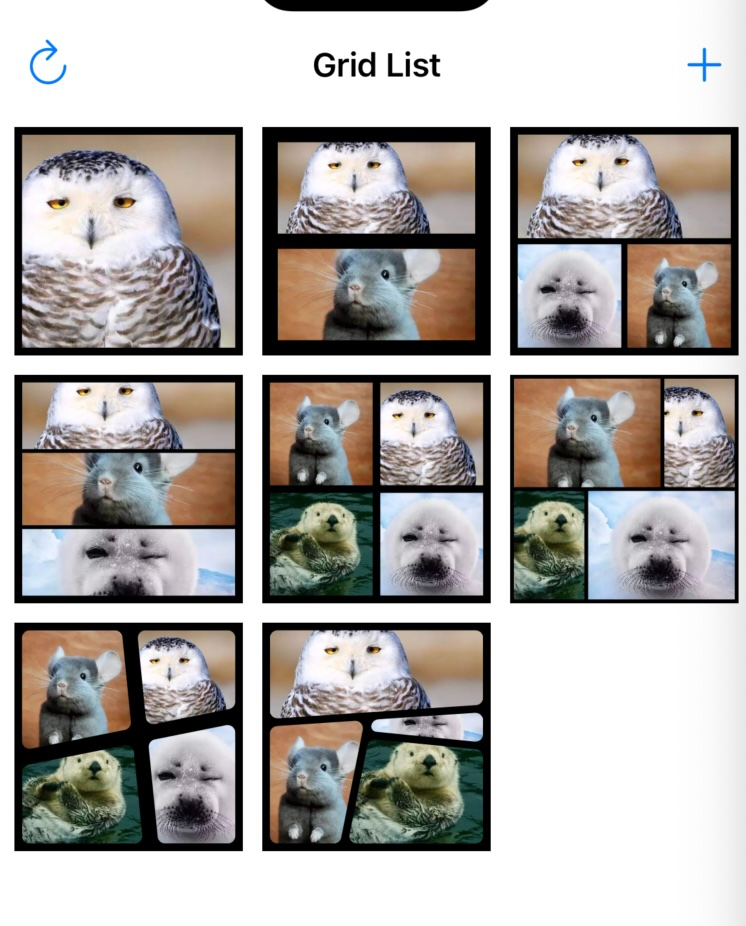

#  Photo Grid 研究

可以布局的view

已完成部分：

- 多边形切割
- 多边形点击高亮
- 分割线移动
- grid用json定义、导出json
- 外边、内边
- 圆角
- grid整体缩放



json的描述举例

// line的方向会影响left和right的位置
// line的x1y1为下，x2y2为上，切出来的左右两份分别为left和right

```json
{
    "width": 320,
    "height": 320,
    "item": {
        "type": "line",
        "key": 0,
        "line": {
            "x1": 0,
            "y1": 100,
            "x2": 300,
            "y2": 80
        },
        "offset": {
            "dx": 30,
            "dy": 30
        },
        "left": {
            "type": "polygon",
            "key": 0,
            "controllableKeys": [
                0
            ]
        },
        "right": {
            "type": "line",
            "key": 1,
            "line": {
                "x2": 160,
                "y2": 0,
                "x1": 100,
                "y1": 320
            },
            "left": {
                "type": "polygon",
                "key": 1,
                "controllableKeys": [
                    0,
                    1
                ]
            },
            "right": {
                "type": "line",
                "key": 2,
                "line": {
                    "x1": 0,
                    "y1": 200,
                    "x2": 320,
                    "y2": 230
                },
                "left": {
                    "type": "polygon",
                    "key": 2,
                    "controllableKeys": [
                        0,
                        1,
                        2
                    ]
                },
                "right": {
                    "type": "polygon",
                    "key": 3,
                    "controllableKeys": [
                        1,
                        2
                    ]
                }
            }
        }
    }
}
```

